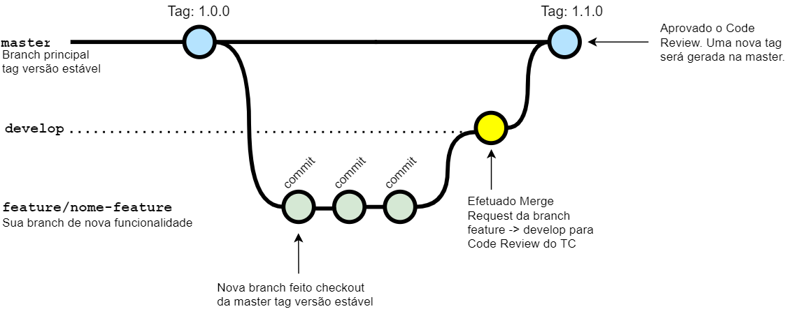

# Contribuição

Caso esteja buscando um tema para contribuir, confira informações de backlog em [HELPWANTED.md](HELPWANTED.md)

## Contribuindo com este Produto

Passo-a-passo para contribuir com este código:

1. Criar uma nova feature branch.
2. Realizar as alterações desejadas.
3. Entrar em contato com os Maintainers através de uma [Issue no GitLab](https://github.com/jfonseca85/arquitetura-onion/issues.*
4. Atualizar a documentação do produto caso necessário.
5. Realizar Merge Request para a branch **develop** informando o Issue correspondente.
6. Entrar em contato com o Maintainer para realização do code review, revisão da documentação e aprovação do Merge Request.

- *Caso não haja Issue aberta, efetuar criação de uma nova tarefa para cobrir sua necessidade.

Com essa alteração aprovada, será gerada uma **nova tag** para disponibilização da solução ou feature desenvolvida.

Confira o git-flow detalhado neste diagrama:

## Nossos Produtos

- [Control Plane Agent](https://github.com/jfonseca85/arquitetura-onion/issues)

## Sobre OpenSource

## Contatos

Squad Poseidon:

- [JL_FONSECA](luis.engcomp@gmail.com)
